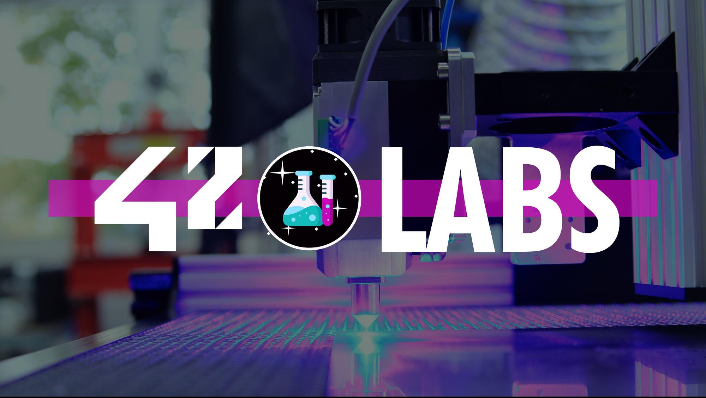
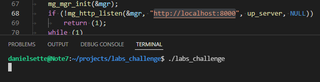
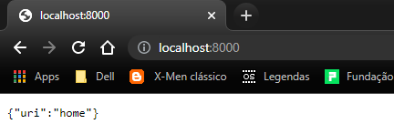

# DESAFIO:




> ⚠️ Estatus: Em desenvolvimento ⚠️

Nesse desafio tivemos que construir duas aplicações utilizando C: uma API e uma aplicação de interface de linha de comando(CLI).

## Ajustes e melhorias:

> API:

- [] Implementar uma requisição do tipo GET consumindo uma API externa;
- [] Devolver o resultado da requisição em uma URI;
- [] Devolver um código HTML na /home;

> CLI:

- [] Criar um código que imprima no terminal os logs;
- [] Agrupar e organizar os logs para facilitar a leitura;

## 💻 Pré-requisitos:

- Antes de começar, verifique se você atendeu aos seguintes requisitos:

* Você instalou a [libcurl](https://websetnet.net/pt/how-to-install-curl-on-ubuntu-quick-tip/)?
[Até este momento do projeto temos somente essa lib para instalar]

## 🚀 Baixando o labs_challenge:

```
git clone <link do projeto no github>
```

## 🗝️ Como testar o funcionamento e utilizar o código:

Entre no diretório do projeto:
```
cd labs_challenge
```

Execute o comando `make`:
```
make
```

Rode o arquivo executavel `labs_challenge` como abaixo:
```
./labs_challenge
```

Você verá que o terminal ficará em um loop:




Agora é só colar o link da porta ```http://localhost:8000 ``` no seu navegador, ou em um aplicativo como [Insomnia](https://insomnia.rest/download) ou [Postman](https://www.postman.com/downloads/)




[⬆ Voltar ao topo](#DESAFIO)<br>